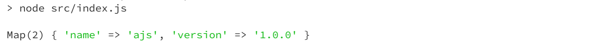
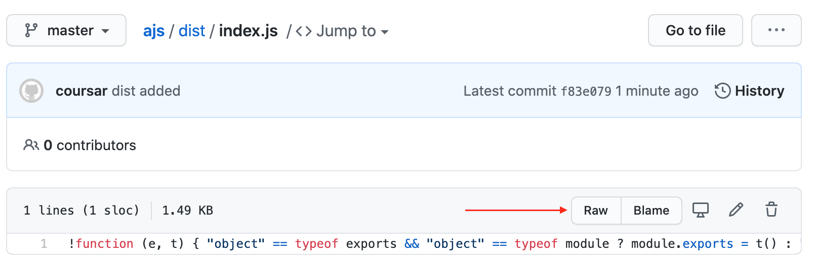
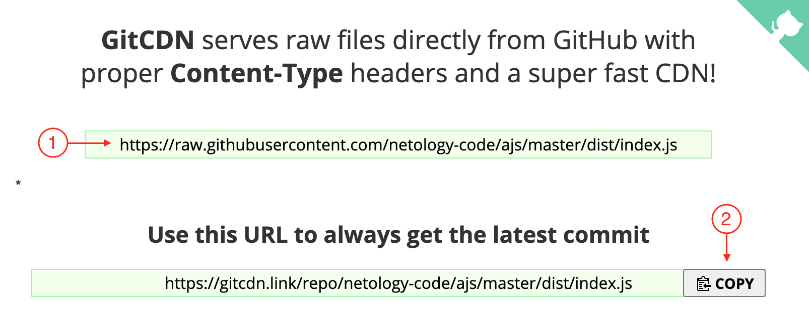
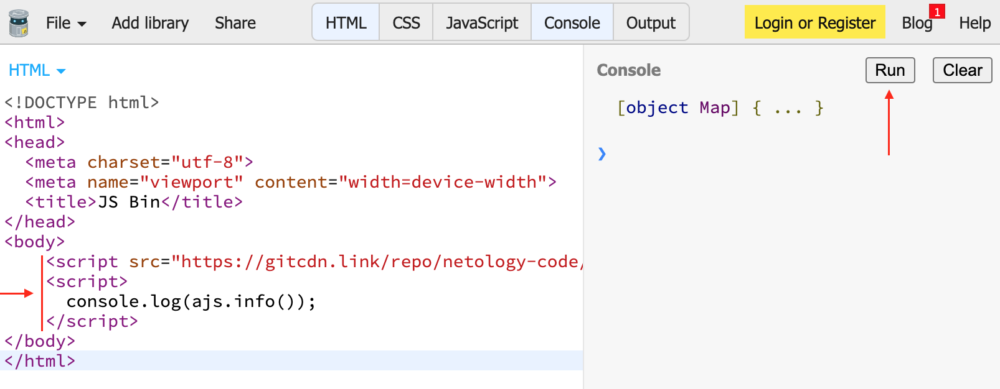
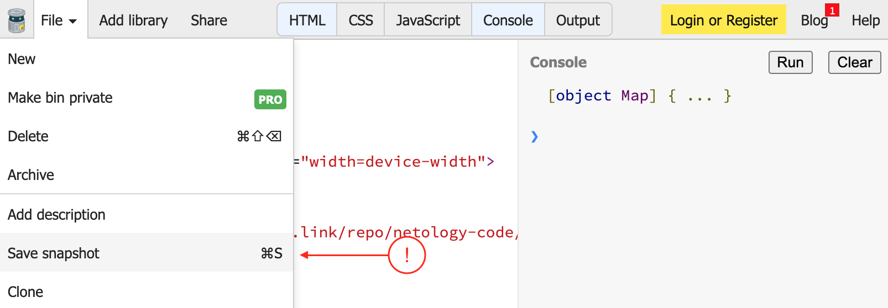

# Домашнее задание №2 к лекции «Платформы: браузер vs Node.js»

## Библиотека для браузера и Node.js

#### Шаг 7. Использование библиотеки
(предыдущие шаги описаны в репозитории к ДЗ №1)

Нас будет интересовать два варианта использования (поскольку через шаблон Webpack всё будет работать как обычно):
* в Node.js
* в браузере через тег script

Итак, в Node.js:
1. Создайте новый проект (GitHub репозиторий, clone, перейдите в каталог склонированного репо), выполните в нём команду: `npm init`
1. Установите ваш пакет: `npm install @netology-code/ajs@1.0.0` (естественно, вам нужно писать не netology-code, а имя своего репо)
1. Создайте файл `src/index.js` следующего содержания:

```js
// у вас будет не netology-code, а ваш username
const ajs = require('@netology-code/ajs');

console.log(ajs.info());
```

Пропишите скрипт запуска (в package.json):
```
"scripts": {
   "start": "node src/index.js"
}
```

Проверьте, что запускается (`npm start`):



Теперь сделаем почти то же самое в браузере. Здесь нам придётся немного посложнее, поскольку для npmjs.com есть специальный CDN https://unpkg.com/, который вам позволяет через URL подключать конкретные файлы.

Для GitHub Packages такого пока нет, поэтому придётся сделать чуть по-другому.

Удалите каталог dist из .gitignore и запушьте его на GitHub (удостоверьтесь, что он там появился):


Перейдите к файлу index.js (который в каталоге dist) и нажмите на кнопку Raw:



Скопируйте URL из строки браузера (в примере он вот такой: https://raw.githubusercontent.com/netology-code/ajs/master/dist/index.js).

Теперь перейдите на сервис [GitCDN](https://gitcdn.link/), подставьте получившийся URL в верхнее поле (1), а с нижнего скопируйте итоговый URL (2):



Остался последний штрих: воспользуйтесь сервисом [JSBin](https://jsbin.com) для того, чтобы быстро проверить работоспособность вашего кода:



После чего выберите File -> Save Snapshot:



После этого станет активна кнопка Share (вам нужно скопировать URL):


### Итого

Вы присылаете три ссылки:
1. Ссылка на репозиторий с вашим пакетом
1. Ссылка на репозиторий проект с Node.js
1. Ссылка на JSBin

### Дополнительно

Если хотите, можете пообновлять версии, делается это с помощью команды `npm version <новый номер версии>`. Обратите внимание, вам не дадут два раза опубликовать пакет с той же версией (т.е. делать `npm publish` не изменив версию пакета нельзя). [Ссылка на документацию](https://docs.npmjs.com/cli/v7/commands/npm-version)

Если у вас что-то не получилось, скидывайте номер шага и скриншот с выводом, чтобы мы могли понять, что не так.

Репозиторий из примеров расположен по ссылке: https://github.com/netology-code/ajs
